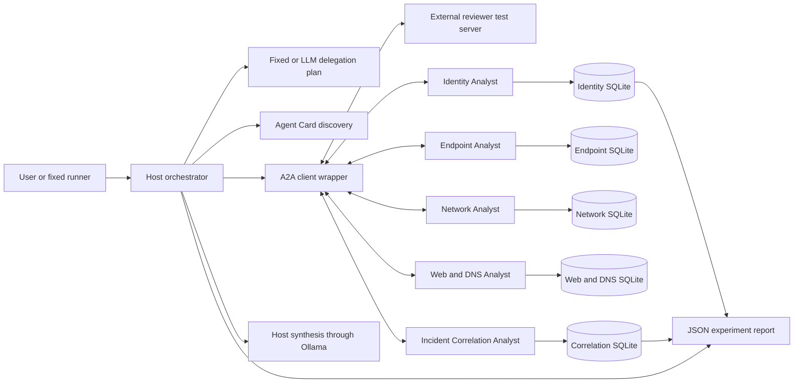
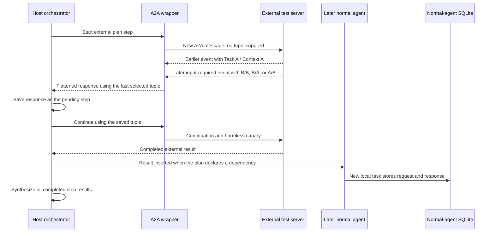

# Threat model for the A2A Gap 3 log-review framework

Status: initial working threat model  

## 1. Purpose

This threat model describes the current five-agent log-review framework and the
EA-A3, TM-1, TM-2, DO-2, DO-3, DO-5, and DO-6 experiments already carried out
inside the local testbed. It is meant to guide defensive changes to the
framework. It does not add a new attack or claim that the test server has any
effect outside the sandbox.

The main security question is:

> Can the host keep a remote task ID and context ID bound to the same remote
> endpoint, plan step, request, and conversation even when that endpoint sends
> several A2A events in an unexpected order?

The follow-up question is what happens to an accepted external result after the
host places it into later delegated requests, final synthesis, and normal-agent
SQLite records.

## 2. System being modeled

The user or fixed experiment runner sends a request for a local case such as
`CYBER-SANDBOX-A`. The host discovers remote Agent Cards, creates a delegation
plan, calls the selected agents through the A2A client wrapper, and asks the host
LLM to synthesize the completed step results. Normal agents use Ollama and keep
their own A2A tasks in separate SQLite databases.

The five normal remote roles are:

1. Identity Analyst
2. Endpoint Analyst
3. Network Analyst
4. Web and DNS Analyst
5. Incident Correlation Analyst

The current Gap 3 live plans use the Identity Analyst and Incident Correlation
Analyst plus the deterministic External Security Reviewer Test Agent. The other
three agents remain part of the normal five-agent framework but are not called
by these fixed experiments.

## 3. Identities that must not be confused

The framework uses several identifiers for different purposes. They should not
be treated as if they were one shared ID.

| Identity | Meaning | Current owner |
| --- | --- | --- |
| Experiment run ID | One control or attack run and its report | Experiment runner |
| Plan step ID | One position in the host delegation plan | Host router/orchestrator |
| Remote endpoint URL | The agent selected for the step | Discovery and plan |
| A2A task ID | One task at one remote agent | Remote agent, returned over A2A |
| A2A context ID | The remote conversation containing that task | Remote agent, returned over A2A |
| Case label | The selected harmless log packet, such as `CYBER-SANDBOX-A` | Local case store |
| Packet hash | SHA-256 digest of the fixed case packet | Local case builder/store |
| Evidence group | The subset of log evidence assigned to a specialist | Host case store |

EA-A3 changes the external step's A2A tuple from A/A to B/B. TM-1 and TM-2
produce B/A and A/B. When those external results later reach a normal agent,
that normal agent still creates its own new task ID and context ID. The retained
evidence therefore demonstrates external tuple confusion and content
propagation, not replacement of a normal agent's own database tuple.

## 4. Assets and security goals

| Asset | Security goal |
| --- | --- |
| Task/context tuple | Both IDs remain paired and bound to one endpoint, host run, and plan step. |
| Continuation message | A user message resumes only the task that actually requested it. |
| Delegation plan | Only declared dependencies become input to another agent. |
| Local case packet | The case label, packet hash, and evidence group remain accurate. |
| Normal-agent records | Stored tasks retain their own tuple and clear provenance for imported content. |
| Final host answer | The answer does not silently present untrusted external content as trusted case evidence. |
| Agent identity | The host knows that the endpoint is the intended remote agent. |
| Audit evidence | Reports accurately show the request, event order, chosen tuple, propagation, and storage result. |
| Availability | One remote task cannot leave the whole plan waiting forever. |

The central security invariants are:

1. One A2A stream belongs to one accepted task/context tuple.
2. A continuation response must match the tuple sent in the continuation request.
3. A tuple is also bound to its remote endpoint, host run, and plan step.
4. A remote response reaches another agent only through a declared dependency.
5. Imported text keeps its source and trust label through synthesis and storage.
6. Case metadata comes from host-owned state, not untrusted response text.
7. A rejected tuple cannot create a continuation, downstream request, or stored canary.

## 5. Actors and assumptions

| Actor | Role in this model | Trust level |
| --- | --- | --- |
| Undergraduate researcher | Starts local services and chooses the experiment | Trusted operator |
| Fixed experiment runner | Selects a documented plan and supplies one harmless continuation | Trusted test component |
| Host orchestrator | Controls plan execution, pending state, dependencies, and synthesis | Trusted security boundary |
| A2A client wrapper and SDK | Converts a stream of protocol events into one response | Trusted code handling untrusted input |
| Five normal log-review agents | Analyze assigned fake evidence with Ollama | Trusted local services, but their model output is not authoritative evidence |
| External reviewer test server | Sends deterministic, structurally valid test events | Intentionally untrusted for these experiments |
| Ollama models | Produce delegated answers and host synthesis | Local but nondeterministic data processors |
| SQLite task stores | Persist normal-agent task history and artifacts | Trusted local storage |

Current testbed assumptions are that all services run on loopback, the case data
is fake, all canaries are inert text, no outside party is involved, and the
operating system itself is not compromised. These assumptions reduce real-world
exposure, but they do not remove the protocol-integrity defect being measured.

## 6. Trust boundaries

| Boundary | Data crossing it | Main concern |
| --- | --- | --- |
| TB-1: user/runner to host | Initial request or continuation text | A new request can be mistaken for continuation text while the host is pending. |
| TB-2: discovery to plan | Agent Card name, skill, and URL | The host currently relies on the discovered endpoint without a framework-level identity proof. |
| TB-3: remote A2A stream to wrapper | Messages, task events, status events, artifacts, task IDs, and context IDs | A later event can replace handles selected from an earlier event. |
| TB-4: wrapper to orchestrator | One flattened response, state, task ID, and context ID | The orchestrator cannot see that the selected tuple changed inside the stream. |
| TB-5: pending host state to continuation request | Stored task/context tuple and user text | A forged or split tuple can be reused in a real second A2A request. |
| TB-6: one step to a dependent step | Earlier response text inserted into a later prompt | Accepted external text can influence another model and its stored task. |
| TB-7: normal agent to SQLite | Request, response, artifacts, task/context IDs, and case evidence | Imported text can become durable even though the local tuple remains separate. |
| TB-8: all step results to host synthesis | Results from every completed plan step | An independent result can reach the final answer even when it was not a dependency of another agent. |
| TB-9: runtime to JSON report | Observations and database snapshots | Local evidence is useful but is not currently signed or hash-chained. |

## 7. Demonstrated attack path

The common path exercised by the successful tuple tests is:

The test server does not directly edit host memory or a normal-agent database.
It controls its own A2A responses. The vulnerable wrapper selects the IDs from
the last relevant event, and the host then acts on that flattened result. Any
later database appearance happens because the host includes the accepted text
in a normal delegated request and that normal agent stores its own task.

## 8. Results already established

| Test | What was sent | What the current evidence establishes |
| --- | --- | --- |
| EA-A3 | A/A first, followed by input-required B/B | The wrapper selected B/B, the host saved B/B, and the real continuation request reused B/B. This is a confirmed whole-tuple rebinding. The retained standalone run had one external step and did not test a normal-agent database. |
| TM-1 | A/A first, followed by input-required B/A | The wrapper and host accepted a task ID from B with a context ID from A, then continued that split tuple. This confirms that task and context continuity are not validated as a pair. |
| TM-2 | A/A first, followed by input-required A/B | The opposite split was also accepted and continued. Together, TM-1 and TM-2 show that neither half of the tuple is independently pinned. |
| DO-2 | Identity, external EA-A3 step, then Correlation depending on the external step | After continuation, the external canary entered Correlation's request and one new Correlation database task. The model did not repeat the run canary in its response in the retained run, but final synthesis still contained it. |
| DO-3 | Identity, independent external EA-A3 step, then Correlation depending only on Identity | Correlation's request and database did not contain the external run canary. This shows that `depends_on` blocked direct downstream transfer. The final host synthesis still contained the canary because synthesis received every step result. |
| DO-5 | External EA-A3 step followed by two agents that both depend on it | The canary reached both normal-agent requests, both model responses, two SQLite task rows, and final synthesis. This demonstrates fan-out after an external result is accepted. |
| DO-6 | Identity before the external EA-A3 step and Identity again afterward | The first Identity task was clean. The second Identity request depended on the external step and stored the run canary in one later Identity task. This demonstrates order-dependent persistence without changing the agent's own task/context IDs. |

The controls are important. Their ordinary canaries followed the same declared
dependency paths. Therefore, the DO tests do not show that the server bypassed
the plan's dependency graph. They show the propagation and persistence surface
available after the host has accepted an external result. The attack-specific
finding is the forged or split external tuple and its continuation. The plan
topology determines where the resulting text can travel.

These are representative single retained runs, not a statistical success rate.
Ollama responses can vary, so request, wrapper, tuple, and database layers are
stronger evidence than whether a model happens to repeat a canary in prose.

## 9. Threat register

Risk is a qualitative starting point for deciding what to fix first. “Confirmed”
means the behavior appears in retained experiment evidence. “Potential” means
the code path suggests a concern, but the current experiment set has not tested
or proven it.

| ID | Threat | Threat Area | Evidence status | Initial risk | Why it matters |
| --- | --- | --- | --- | --- | --- |
| G3-T01 | Remote agent or Agent Card identity substitution | Spoofing | Potential | High outside loopback | A host that cannot authenticate an endpoint may trust the wrong source before tuple validation even begins. This was not the cause tested by EA-A3 because the runner deliberately selected the local test endpoint. |
| G3-T02 | Late-event whole-tuple rebinding | Tampering | Confirmed by EA-A3 | High | A later B/B event replaces A/A inside one stream and becomes host pending state. |
| G3-T03 | Half-tuple splicing | Tampering | Confirmed by TM-1 and TM-2 | High | B/A and A/B were both treated as valid continuation handles even though the pair had no established continuity. |
| G3-T04 | Misbound continuation | Tampering / elevation of influence | Confirmed by EA-A3, TM-1, and TM-2 | High | The host turns an unvalidated response tuple into a second request, giving the tuple an effect beyond the original response. |
| G3-T05 | Plan-wide input-required blocking | Denial of service | Confirmed behavior | Medium | One step pauses the sequential plan. In normal use, the next user message is automatically treated as its continuation. |
| G3-T06 | Direct dependency contamination | Tampering | Exposure confirmed by DO-2, DO-5, and DO-6 | High when external text is trusted | An accepted external result is copied into later model prompts and can become stored request or response data. This follows declared dependencies rather than bypassing them. |
| G3-T07 | Fan-out to more than one normal agent | Tampering | Exposure confirmed by DO-5 | High when downstream actions are important | One accepted result can influence several separate tasks and databases. |
| G3-T08 | Final synthesis over-inclusion | Tampering / information flow | Confirmed by DO-3 | Medium to high | Final synthesis receives every step result even when a normal downstream agent did not depend on the external step. |
| G3-T09 | Durable content contamination in SQLite | Tampering / repudiation | Confirmed by TM-1, TM-2, DO-2, DO-5, and DO-6 | High when records are reused | A canary can persist in new normal-agent history or artifacts. The row keeps the normal agent's own tuple, so the issue is content provenance rather than database-ID overwrite. |
| G3-T10 | Case metadata confusion through text parsing | Tampering | Potential | Medium | Remote executors extract the last matching `[local-case]` block from request text. A host-owned structured binding would be safer than relying on a text block. No retained Gap 3 test attempts this. |
| G3-T11 | Cross-run replay or stale tuple reuse | Spoofing / tampering | Potential | High | The current code records run and step bindings but does not enforce freshness, expiry, or one-time use at the wrapper boundary. No retained test proves replay. |
| G3-T12 | Audit evidence modification | Tampering / repudiation | Potential | Medium | JSON observations are detailed but not cryptographically signed or hash-chained after creation. This affects research evidence integrity, not live tuple routing. |
| G3-T13 | Model treats imported text as instructions | Tampering | Potential, partly reduced by prompts | Medium | The host labels dependency results as untrusted reference data, but this is a prompt instruction rather than a hard data boundary. Current canaries are inert and do not test harmful instructions. |

## 10. Existing protections

The current framework already has useful research controls:

1. All attack services and data are local and use harmless, unique canary text.
2. Attack and control runs use fixed plans, so LLM planning does not change the
   comparison.
3. Every run has a unique run ID and canary.
4. The report records transport requests, SDK events, wrapper state after each
   event, host step results, continuation handles, final output, and SQLite
   before/after evidence.
5. The case packet is validated against a SHA-256 hash before use.
6. Each specialist receives only its assigned evidence group from the host.
7. Only declared `depends_on` results enter a downstream delegated request.
8. Dependency results are labeled as untrusted reference data in the delegated
   prompt.
9. Normal agents keep separate SQLite task stores.
10. A2A calls use a configured timeout.

These controls make the experiments reproducible and limit their scope. They do
not currently enforce stream-level tuple continuity or authenticate a remote
peer.

## 11. Main weaknesses in the current implementation

1. The wrapper updates the selected task ID and context ID after every streamed
   event. It returns the last selected values without checking them against the
   first accepted tuple.
2. On continuation, the wrapper does not require the response tuple to equal the
   tuple placed in the outgoing request.
3. The orchestrator records tuple bindings but does not enforce them.
4. The host stores an input-required response directly as pending state, so an
   unvalidated tuple becomes the authority for the next request.
5. Pending state is global to the orchestrator instance. Any next user message
   is continuation text while that state exists.
6. Final synthesis receives all step results, not an explicit set of results
   approved for synthesis.
7. Trust and provenance are written into ordinary prompt text instead of being
   enforced as structured data through every layer.
8. Agent discovery and A2A transport have no additional framework-level peer
   authentication or signed Agent Card validation.
9. Reports are descriptive records, not tamper-evident security logs.

## 12. Prioritized hardening plan

### Priority 0: enforce tuple continuity

1. Pin the first valid task/context pair returned for a new request. Reject the
   stream if either value changes later unless the protocol defines and the host
   explicitly approves a new-task transition.
2. For a continuation, pin the pair before sending the request. Reject any task,
   status, artifact, or message event carrying a different task ID or context ID.
3. Reject half-tuple changes. A task ID and context ID should be validated as one
   pair, not as two unrelated strings.
4. Bind the accepted tuple to `(remote endpoint, host run, plan step)` and check
   that binding before saving pending state and before every continuation.
5. Fail closed before creating pending state when the stream is inconsistent.

### Priority 1: contain accepted external content

1. Carry dependency results as structured records containing source endpoint,
   source step, source tuple, run ID, and trust level rather than as an unlabeled
   text block alone.
2. Add an explicit `include_in_synthesis` policy. DO-3 shows that dependency
   isolation and final-synthesis isolation are currently different boundaries.
3. Store provenance beside imported dependency text in normal-agent evidence
   records. Do not imply that imported text came from the local log packet.
4. Keep the host-generated case label, packet hash, and evidence group outside
   model-controlled text where possible, then compare them again before storage.
5. Define a safe failure result for dependent steps when an upstream tuple is
   rejected. The result should explain the rejection without copying the
   rejected content.

### Priority 2: strengthen identity, audit, and availability

1. Add authenticated transport and verify that the remote identity is authorized
   for the selected Agent Card and plan step. Keep this configurable for the
   loopback research mode.
2. Add tuple expiry, replay detection, and an idempotency policy for
   continuations.
3. Give pending entries an explicit run ID, user/session owner, creation time,
   and expiry instead of relying only on one global pending field.
4. Hash-chain or sign completed reports and record the software version used for
   each run.
5. Apply per-step continuation and retry limits so input-required cannot hold a
   plan indefinitely.

## 13. Defensive validation matrix

The existing fixtures can become regression tests for the hardening work. The
goal is to change the security outcome while keeping the harmless controls
working.

| Test after hardening | Expected secure result |
| --- | --- |
| EA-C0 | Coherent A/A completion is accepted normally. |
| EA-C2 | Coherent input-required A/A is saved, continuation uses A/A, and the response must remain A/A. |
| EA-A3 | The A/A to B/B transition is rejected before pending state; no B/B continuation is sent. |
| TM-1 | B/A is rejected as a split tuple; no continuation is sent. |
| TM-2 | A/B is rejected as a split tuple; no continuation is sent. |
| DO-2 attack | External tuple rejection prevents the external canary from entering Correlation or its database. |
| DO-3 attack | The independent clean path may finish, but rejected external content is absent from Correlation, final synthesis, and SQLite. |
| DO-5 attack | Tuple rejection occurs before fan-out; neither normal-agent database contains the attack canary. |
| DO-6 attack | The first clean Identity task may remain, while the later dependent task is skipped or safely marked blocked without storing the attack canary. |

For each regression run, check all of these layers rather than only the final
model prose:

1. raw event order;
2. wrapper-selected tuple after every event;
3. whether pending state was created;
4. outgoing continuation tuple;
5. downstream delegated requests;
6. normal-agent task/context IDs and stored content;
7. final synthesis input and output;
8. explicit rejection reason in the audit report.

## 14. Limitations and open questions

1. The retained live results are one representative run per case and control.
   Repeated trials are needed before reporting rates or model-level statistics.
2. Only two of the five normal agents are used in the fixed Gap 3 plans. The
   same containment policy should later be checked across all five roles.
3. The current tests establish tuple acceptance and canary flow. They do not
   prove remote code execution, operating-system compromise, or direct editing
   of another agent's database.
4. Authentication, replay, forged case blocks, concurrent users, and report
   tampering are threat-model findings, not completed attack results.
5. Model output is nondeterministic. A missing canary in model prose does not
   prove containment when the request or database still contains it.
6. The risk ratings are preliminary prioritization judgments for this framework,
   not measured probabilities or claims about every A2A deployment.

## 15. Evidence and code map

- [Editable Lucidchart/Draw.io threat-model visual](A2A_Gap3_Threat_Model.drawio)
- [Framework overview](README.md)
- [Experiment design and code-reading order](security/event_attribution/README.md)
- [Saved evidence index](logs/README.md)
- [A2A client wrapper](host/client.py)
- [Host pending state and dependency processing](host/orchestrator.py)
- [Fixed test plans](security/event_attribution/fixed_plans.py)
- [Deterministic response fixtures](security/event_attribution/scenarios.py)
- [Live experiment runner](security/event_attribution/live_experiment.py)
- [Database evidence collector](security/event_attribution/database_evidence.py)
- [Local case binding](cyber/cases.py)
- [Normal-agent evidence storage](remote/case_evidence.py)
- [Deterministic EA-A3 report](logs/audit/gap3_runs/gap3-ea-a3-e974043a8f6748e397252b56394a2851.json)
- [Deterministic EA-C0 control](logs/audit/gap3_runs/gap3-ea-c0-3cf620219f8f4fff8cee2619e1b24e80.json)
- [DO-5 fan-out report](logs/audit/gap3_live_runs/gap3-live-do-5-attack-69b8a6ead69a4dfaad88795d364b48ba.json)
- [DO-3 independent-path report](logs/audit/gap3_live_runs/gap3-live-do-3-attack-f6756a746de34f43b651ec4153bb1e95.json)
